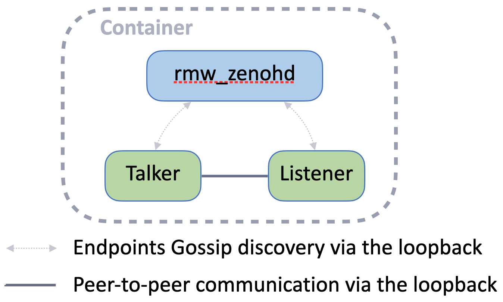

# Exercise 1 - Zenoh router and ROS Nodes

The primary role of the Zenoh router is to act as a discovery service for ROS nodes running on the same host.
When a node starts, it automatically tries to connect to the local Zenoh router. If the connection fails, the node waits until the router becomes available. The router shares the locators (IP + port) of each node with others, allowing them to automatically establish peer-to-peer connections. Once nodes are connected, they no longer need the router to communicate with each other.

## Simple Talker/Listener Test

To test this, open three different terminals within the same container (using the `login_container.sh` script under the `docker` directory) and run the `demo_nodes_cpp` package's `talker` and `listener`:

1. Run the talker (it will print a warning about waiting for the Zenoh router): `ros2 run demo_nodes_cpp talker`
2. Start the Zenoh router (the talker should now begin publishing messages): `ros2 run rmw_zenoh_cpp rmw_zenohd`
3. Run the listener (it should receive messages from the talker): `ros2 run demo_nodes_cpp listener`
4. Press `CTRL+C` to stop the Zenoh router. The talker and listener will continue exchanging messages without the router.

> [!WARNING]
> By default a Node will check if a Zenoh router is available at startup once. To make the Node skip this Zenoh router check or attempt its discovery more than once define the following environment variable for each of your Node accordingly:
> `ZENOH_ROUTER_CHECK_ATTEMPTS=-1` # For skipping check
> `ZENOH_ROUTER_CHECK_ATTEMPTS=0` # For checking maximum value of attempts

## Bonus - Service, Action and Introspection

You can also test with a ROS service:

* Server: `ros2 run demo_nodes_cpp add_two_ints_server`
* Client: `ros2 run demo_nodes_cpp add_two_ints_client`

And with an Action:

* Action server: `ros2 run action_tutorials_cpp fibonacci_action_server`
* Action client: `ros2 run action_tutorials_cpp fibonacci_action_client`

Additionally, you can use the `ros2` command-line tool to inspect the system:

* List nodes: `ros2 node list`
* List topics: `ros2 topic list`
* List services: `ros2 service list`
* List actions: `ros2 action list`

Even if the Zenoh router is stopped, the `ros2` command-line tool will continue to function.
Why?

Answer

When you run a `ros2` command for the first time, it starts the ROS 2 daemon, which is a regular ROS node. This node connects peer-to-peer with other nodes, acts as a cache of the ROS graph, and can directly respond to queries from the `ros2` command-line tool.

---
[Next exercise ➡️](ex-2.md)
