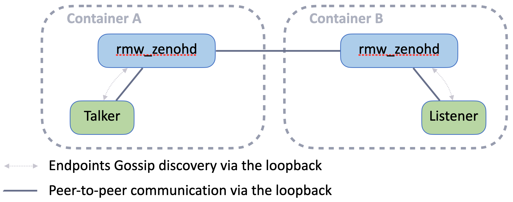
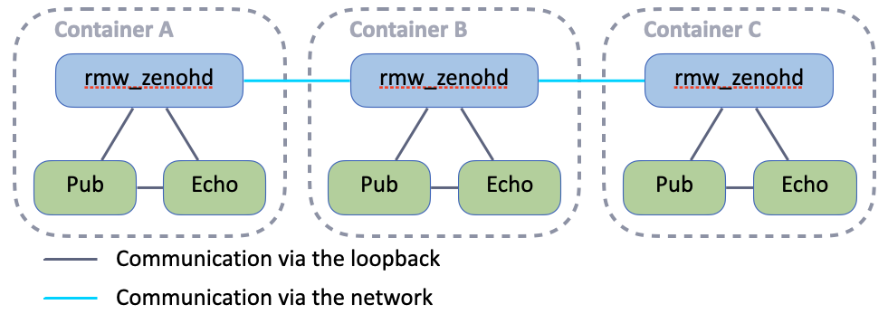

# Exercise 2 - Routers connections


The second role of the Zenoh router is to route the traffic for external communications.  
The benefits being:
  - less interconnections between Nodes and thus less network overhead
  - automatic batching of small messages for a better throughput
  - smaller surface of attack (only 1 port open)
  - a single place to configure access control and downsampling

### Configuration

Partner with another attendee and decide who will connect his container (A) to the other's container (B).  
The attendee with container A must create a configuration file for the router to connect the router in container B:

- copy the file `zenoh_confs/DEFAULT_RMW_ZENOH_ROUTER_CONFIG.json5` as `zenoh_confs/ROUTER_CONFIG.json5`
- edit `zenoh_confs/ROUTER_CONFIG.json5` and set a `connect.endpoints` configuration as such:
  ```json5
  connect: {
    endpoints: [
      "tcp/<host_B_IP>:7447"
    ],
  },
  ```
  Where `<host_B_IP>` is the IP address of the host running the container B.

The attendee with container B has nothing to do. By default the Zenoh router is listening to incoming TCP connections on port 7447 via any network interface.
And the container was created with a mapping of host' port 7447 to container port 7447.

### Run

Now you can run the following commands in your respective containers:
- In container A:
  - `ZENOH_ROUTER_CONFIG_URI=/ros_ws/zenoh_confs/ROUTER_CONFIG.json5 ros2 run rmw_zenoh_cpp rmw_zenohd`
  - `ros2 run demo_nodes_cpp talker`
- In container B:
  - `ros2 run rmw_zenoh_cpp rmw_zenohd`
  - `ros2 run demo_nodes_cpp listener`

You can switch the containers running `talker` and `listener`, meaning the interconnection between the routers is well bi-directional.  
You can also check that if you kill a router the communication stops. If your restart it, the communication resumes.

<p align="center"></p>


### Bonus - multiple routers inter-connections

Try to add more connections to other attendees' containers (`connect.endpoints` configuration is a list).
Each of you can run within its container:
- `ros2 topic pub /chatter std_msgs/msg/String "data: Hello from <YOUR_NAME>"` - (replacing `<YOUR_NAME>`)
- `ros2 topic echo /chatter`

Also try different configuration of inter-connections such as a chain:

<p align="center"></p>


### Note - starting another container on the same host

You can run another container with `rmw_zenoh` on the same host.
You just need to use a different container name and a different port mapping.

In each terminal you use for the 2nd container, export those environment variables:
```bash
export CONTAINER_NAME=container_B
export ROUTER_PORT=7448
```
The scripts in [docker/](../docker/) directory will use those environment variables.

To connect the router running in the original container to the router running in this new container, use this configuration in your `zenoh_confs/ROUTER_CONFIG.json5` file:
```json5
  connect: {
    endpoints: [
      "tcp/host.docker.internal:7448"
    ],
  },
```

---
[Next exercise ➡️](ex-3.md)