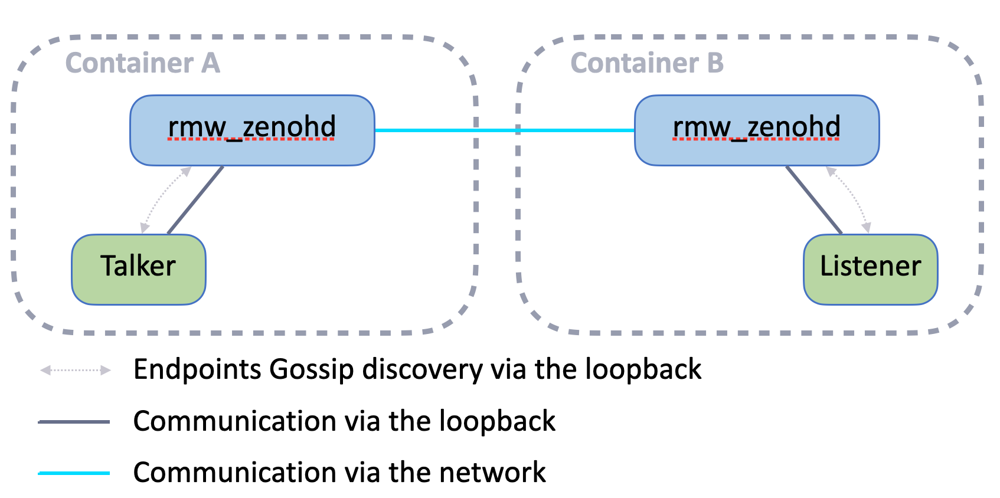

# Exercise 2 - Routers Connections

The second role of the Zenoh router is to route the traffic for external communications. This offers several advantages:

* Fewer direct connections between nodes, reducing network overhead
* Automatic batching of small messages, improving throughput
* Reduced attack surface (only one port needs to be open)
* A centralized point for managing access control and message downsampling

## Configuration

Partner with another attendee and decide who will connect their container (A) to the other's container (B). The attendee using container A must create a configuration file for their router to connect to the container B's router:

1. Copy the file `zenoh_confs/DEFAULT_RMW_ZENOH_ROUTER_CONFIG.json5` and rename it to `zenoh_confs/ROUTER_CONFIG.json5`
2. Edit `zenoh_confs/ROUTER_CONFIG.json5` and set the `connect.endpoints` configuration as follows (Replace <host_B_IP> with the IP address of the host running container B):

```json5
connect: {
  endpoints: [
    "tcp/<host_B_IP>:7447"
  ],
},
```

The attendee with container B has nothing to do. By default the Zenoh router is listening to incoming TCP connections on port 7447 via any network interface.

## Running the Test

Now, run the following commands in each container:

* In container A:
  * Start the router (with the custom configuration): `ZENOH_ROUTER_CONFIG_URI=/ros_ws/zenoh_confs/ROUTER_CONFIG.json5 ros2 run rmw_zenoh_cpp rmw_zenohd`
  * Start the talker: `ros2 run demo_nodes_cpp talker`
* In container B:
  * Start the router (with the default configuration): `ros2 run rmw_zenoh_cpp rmw_zenohd`
  * Start the listener: `ros2 run demo_nodes_cpp listener`

You can also switch the talker/listener roles of the containers (e.g., container A running the listener and container B running the talker) to verify the bidirectional connection between the routers. Additionally, if you stop one of the routers, communication will pause, and once the router is restarted, communication will resume.

<p align="center"></p>

## Bonus - Inter-Connecting Multiple Routers

Try connecting to more attendees' containers by adding additional entries to the `connect.endpoints` list. In each container, you can run:

* Publish your own message: `ros2 topic pub /chatter std_msgs/msg/String "data: Hello from <YOUR_NAME>"`
* Echo messages: `ros2 topic echo /chatter`

Experiment with different connection topologies, such as forming a chain of connected routers:
<p align="center"></p>

## Note -Starting Another Container on the Same Host

To run another container using `rmw_zenoh` on the same host, set the `CONTAINER_NAME` environment variable to a different name (in all terminals):

```bash
export CONTAINER_NAME="container_2"
./docker/create_container.sh
./docker/login_container.sh
```

Since both containers will use the host network, their routers will conflict on port `7447`. You need to configure the second container’s Zenoh router to use a different port, such as `7448`:

* Copy `zenoh_confs/DEFAULT_RMW_ZENOH_ROUTER_CONFIG.json5` to `zenoh_confs/CONTAINER_2_ROUTER_CONFIG.json5`
* Edit `zenoh_confs/CONTAINER_2_ROUTER_CONFIG.json5` and set the `listen.endpoints` configuration as follows:

```json5
listen: {
  endpoints: [
    "tcp/[::]:7448"
  ],
},
```

In the same file you can configure the connections to other routers in `connect.endpoints` as explained above.

* Copy `zenoh_confs/DEFAULT_RMW_ZENOH_SESSION_CONFIG.json5` to `zenoh_confs/CONTAINER_2_SESSION_CONFIG.json5`
* Edit `zenoh_confs/CONTAINER_2_ROUTER_CONFIG.json5` and set the `connect.endpoints` configuration as follows:

```json5
connect: {
  endpoints: [
    "tcp/localhost:7448"
  ],
},
```

This ensures that each node connects to the Zenoh router on port 7448.

In each terminal of your second container, set the following environment variables:

```bash
export ZENOH_ROUTER_CONFIG_URI=/ros_ws/zenoh_confs/CONTAINER_2_ROUTER_CONFIG.json5
export ZENOH_SESSION_CONFIG_URI=/ros_ws/zenoh_confs/CONTAINER_2_SESSION_CONFIG.json5
```

---
[Next exercise ➡️](ex-3.md)
