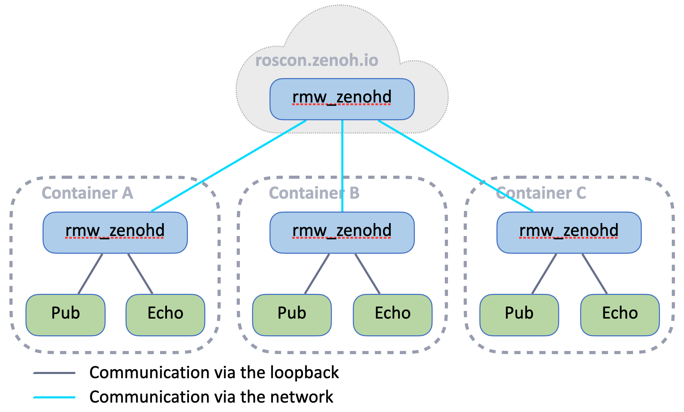

# Exercise 3 - Remote Connection via the Cloud
A Zenoh router deployed in the Cloud with a public IP can act as a relay between two `rmw_zenoh` systems.

<p align="center"></p>

## Configuration
For this workshop, we've deployed a Zenoh router on `roscon.zenoh.io`.
Update your `zenoh_confs/ROUTER_CONFIG.json5` to include the following in the `connect.endpoints` configuration:
```json5
  connect: {
    endpoints: [
      "tcp/roscon.zenoh.io:7447"
    ],
  },
```

## Run
In your container, run the following commands:
* Start the router (with the custom configuration): `ZENOH_ROUTER_CONFIG_URI=/ros_ws/zenoh_confs/ROUTER_CONFIG.json5 ros2 run rmw_zenoh_cpp rmw_zenohd`
* Publish your own message: `ros2 topic pub /chatter std_msgs/msg/String "data: Hello from <YOUR_NAME>"`
* Echo all the messages `ros2 topic echo /chatter`

## Bonus
Try setting a different `ROS_DOMAIN_ID` (e.g., `export ROS_DOMAIN_ID=42`).
What happens, and why?

<details>
<summary>Answer</summary>
Zenoh has no concept of Domain such as DDS. However, `rmw_zenoh` integrates the `ROS_DOMAIN_ID` in the mapping from topic/service names to zenoh key expressions. As a result, even if nodes use the same topic name, they won’t communicate if they are in different domains, even when connected through Zenoh.
</details>

---
[Next exercise ➡️](ex-4.md)