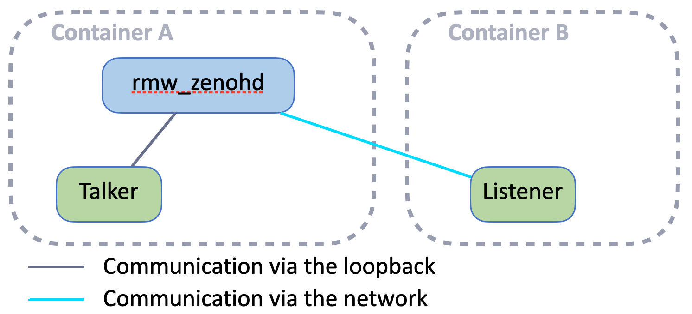
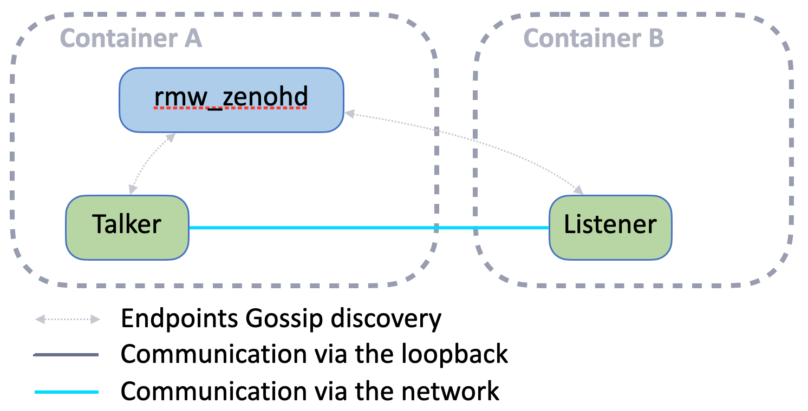

# Exercise 4 - Direct Node connection

The deployment of a router on each host is not mandatory. Actually, in some cases, you would like to have a more direct connection between your robot and a single remote Node (e.g. `rviz2`).

This is possible configuring the Node's Zenoh Session to directly connect to the robot's router. For instance:

<p align="center"></p>


### Configuration

Partner with another attendee and decide who will connect his container (A) to the other's container (B).  
The attendee with container B must create a configuration file for the Listener Node to connect the router in container A:

- copy the file `zenoh_confs/DEFAULT_RMW_ZENOH_SESSION_CONFIG.json5` as `zenoh_confs/SESSION_CONFIG.json5`
- edit `zenoh_confs/SESSION_CONFIG.json5` and set a `connect.endpoints` configuration as such:
  ```json5
  connect: {
    endpoints: [
      "tcp/<host_A_IP>:7447"
    ],
  },
  ```
  Where `<host_A_IP>` is the IP address of the host running the container A.

The attendee with container A has nothing to do. By default the Zenoh router is listening to incoming TCP connections on port 7447 via any network interface.

### Run

Now you can run the following commands in your respective containers:
- In container A:
  - `ros2 run rmw_zenoh_cpp rmw_zenohd`
  - `ros2 run demo_nodes_cpp talker`
- In container B:
  - `ros2 run demo_nodes_cpp listener`

### Bonus

What happens if you kill the router in container A and why ?

<details>
<summary>Response</summary>

The communication between the Talker and the Listener stops!  
The reason is that there was no peer-to-peer connectivity established between the Talker and the Listener, since each one is by default listening for incoming connection only on their respective `localhost` interface. See the `listen.endpoints` configuration in [zenoh_confs/DEFAULT_RMW_ZENOH_SESSION_CONFIG.json5](../zenoh_confs/DEFAULT_RMW_ZENOH_SESSION_CONFIG.json5).

</details>

How to fix this ?

<details>
<summary>Response</summary>

Make the Listener node in container B to listen for incoming connections on any interfaces rather than just `localhost`:
- edit `zenoh_confs/SESSION_CONFIG.json5` and set `listen.endpoints` configuration as such:
  ```json5
  connect: {
    endpoints: [
      "tcp/[::]:0"
    ],
  },
  ```

The Zenoh gossip protocol will do the rest: forwarding the Listener endpoint to the Talker, and the Talker will automatically connect to the Listener.

<p align="center"></p>

</details>

---
[Next exercise ➡️](ex-5.md)