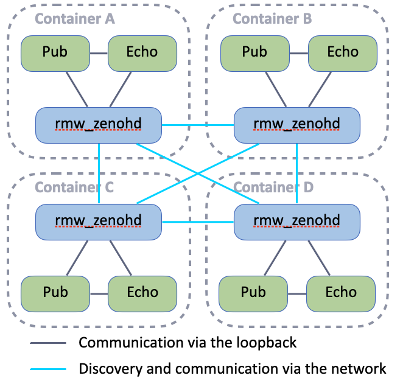
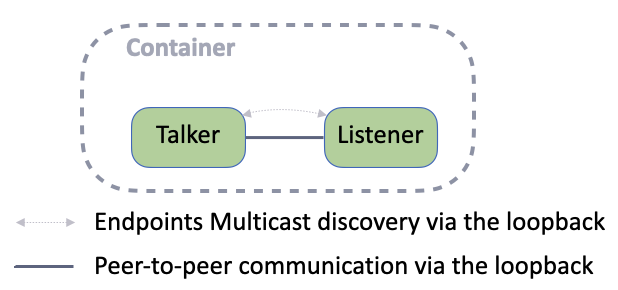
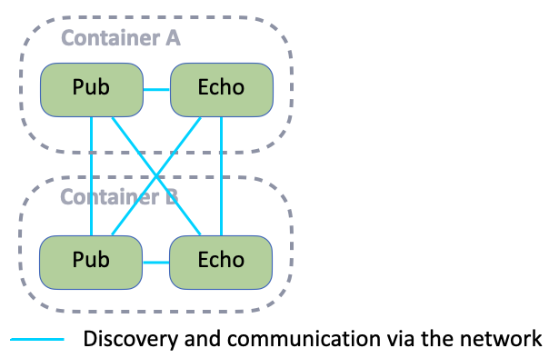

# Exercise 5 - Discovery via UDP multicast

Even if not enabled by default in `rmw_zenoh`, Zenoh can be configured for discovery over UDP multicast in several aspects:
- For the routers to discover each other and to automatically inter-connect with each other.
- For the ROS Nodes to discover each other and to automatically inter-connect with each other. This allows a router-less deployment.

> [!WARNING]  
> If your host runs **MacOS**, your Docker probably doesn't router the multicast traffic, even if the container is using the `--net host` option. Therefore you won't be able to participate to this exercise.


## Routers discovery

Each attendee will run 1 container with the Zenoh router and a publisher and a subscriber on the same topic.
The routers will be configured to discover each other over UDP multicast and to automatically connect to each other.

<p align="center"></p>

### Configuration

Edit your `zenoh_confs/ROUTER_CONFIG.json5` again to:
- remove all endpoints in `connect.endpoints` configuration:
  ```json5
    connect: {
      endpoints: [
      ],
    },
  ```
- configure the `scouting.multicast` setting as such:
  ```json5
   multicast: {
      /// Whether multicast scouting is enabled or not
      enabled: true,
      /// The socket which should be used for multicast scouting
      address: "224.0.0.224:7446",
      /// The network interface which should be used for multicast scouting
      interface: "auto", // If not set or set to "auto" the interface if picked automatically
      /// Which type of Zenoh instances to automatically establish sessions with upon discovery on UDP multicast.
      /// Accepts a single value or different values for router, peer and client.
      /// Each value is bit-or-like combinations of "peer", "router" and "client".
      autoconnect: { router: "router" },
      /// Whether or not to listen for scout messages on UDP multicast and reply to them.
      listen: true,
   }
  ```


### Run

Now you can run the following commands in your container:
- `ZENOH_ROUTER_CONFIG_URI=/ros_ws/zenoh_confs/ROUTER_CONFIG.json5 ros2 run rmw_zenoh_cpp rmw_zenohd`
- `ros2 topic pub /chatter std_msgs/msg/String "data: Hello from <YOUR_NAME>"` - (replacing `<YOUR_NAME>`)
- `ros2 topic echo /chatter`


### Bonus

Run `rmw_zenoh` Nodes without any router in 2 different configurations:
1. the Nodes shall only discover the other Nodes running on the same host
2. the Nodes shall discover all Nodes running in the LAN

> [!WARNING]  
> By default the Node will wait to discover a Zenoh router at startup. To make the Node to skip this Zenoh router check, define this environment variable for each of your Node:
> `ZENOH_ROUTER_CHECK_ATTEMPTS=-1`


<details>
<summary>Solution 1</summary>

<p align="center"></p>

- Copy the file `zenoh_confs/DEFAULT_RMW_ZENOH_SESSION_CONFIG.json5` as `zenoh_confs/SESSION_CONFIG.json5`
- Edit `zenoh_confs/SESSION_CONFIG.json5` and just set `scouting.multicast.enabled` to `true` as such:
  ```json5
   multicast: {
      /// Whether multicast scouting is enabled or not
      enabled: true,
      /// ...
   }
  ```
- Then run:
  - `ZENOH_SESSION_CONFIG_URI=/ros_ws/zenoh_confs/SESSION_CONFIG.json5 ros2 topic pub /chatter std_msgs/msg/String "data: Hello from <YOUR_NAME>"`
  - `ZENOH_SESSION_CONFIG_URI=/ros_ws/zenoh_confs/SESSION_CONFIG.json5 ros2 topic echo /chatter`

</details>

<details>
<summary>Solution 2</summary>

<p align="center"></p>

With previous configuration the Nodes on different hosts didn't discover each other because they're configure to listen for incoming connections only on the localhost interface. To enable inter-hosts discovery and connection, we need to change this.

- Edit the same `zenoh_confs/SESSION_CONFIG.json5` and set the `listen.endpoints` configuration as such:
  ```json5
  listen: {
    endpoints: [
      "tcp/[::]:0"
    ],
  },
  ```
  Here `[::]` means any IPv6 or IPv4 interface, and `0` means the OS will choose an available port number.
- Then run:
  - `ZENOH_SESSION_CONFIG_URI=/ros_ws/zenoh_confs/SESSION_CONFIG.json5 ros2 topic pub /chatter std_msgs/msg/String "data: Hello from <YOUR_NAME>"`
  - `ZENOH_SESSION_CONFIG_URI=/ros_ws/zenoh_confs/SESSION_CONFIG.json5 ros2 topic echo /chatter`

</details>


---
[Next exercise ➡️](ex-6.md)