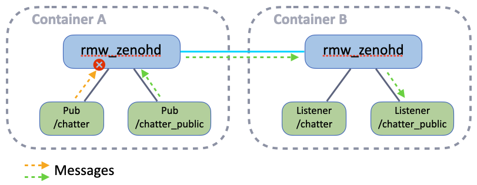

# Exercise 6 - Access Control

By configuration the Zenoh router can deny some topics to be published via a specified interface (e.g. WiFi).

## Configuration

<p align="center"></p>

Partner with another attendee and decide who will connect their container (A) to the other's container (B). The attendee using container A will configure its router to connect to the container B's router, and to deny the publication of a topic via the WiFi interface:

Both attendees shall reset the `zenoh_confs/ROUTER_CONFIG.json5` file, copying again the `zenoh_confs/DEFAULT_RMW_ZENOH_ROUTER_CONFIG.json5` as `zenoh_confs/ROUTER_CONFIG.json5`

Then in container A:

1. Edit `zenoh_confs/ROUTER_CONFIG.json5` and set the `connect.endpoints` configuration as follows (Replace <host_B_IP> with the IP address of the host running container B):

    ```json5
    connect: {
      endpoints: [
        "tcp/<host_B_IP>:7447"
      ],
    },
    ```

2. Run `ip a` command to list your network interfaces and find the name of the WiFi interface.
3. Add this `access_control` configuration at the end of your `zenoh_confs/ROUTER_CONFIG.json5` file (just before the last `}`):

    ```json5
    access_control: {
      enabled: true,
      default_permission: "allow",   // allow all by default
      /// List of rules
      rules: [
        {
          // Rule identifier
          id: "my_rule",
          // Deny publications ("put" Zenoh operation) in egress on WiFi interface for a Zenoh key expression
          permission: "deny",
          messages: [ "put" ],
          flows:["egress"],
          key_exprs: [
            // The Zenoh key expression used for the "/chatter" topic
            //"0/chatter/std_msgs::msg::dds_::String_/RIHS01_df668c740482bbd48fb39d76a70dfd4bd59db1288021743503259e948f6b1a18"
            "*/chatter/**"
          ],
        },
      ],
      /// list of subjects:
      subjects: [
        {
          // Interface identifier
          id: "my_interface",
          interfaces: ["<YOUR_WIFI_INTERFACE>"],
        },
      ],
      /// apply rule to subject in the policies list
      policies: [
        {
          rules: ["my_rule"],
          subjects: ["my_interface"],
        },
      ],
    },
    ```

    Don't forget to replace `"<YOUR_WIFI_INTERFACE>"` with your WiFi interface name !

## Running the Test

Now, run the following commands in each container:

* In container A:
  * Start the router (with the custom configuration): `ZENOH_ROUTER_CONFIG_URI=/ros_ws/zenoh_confs/ROUTER_CONFIG.json5 ros2 run rmw_zenoh_cpp rmw_zenohd`
    You can also add this environment variable to see the router applying the access control:
    `RUST_LOG=info,zenoh::net::routing::interceptor=debug`
  * Start the publisher on the denied topic:
    `ros2 topic pub /chatter std_msgs/msg/String "data: Hello just me!"`
  * Start another publisher on an allowed topic:
    `ros2 topic pub /chatter_public std_msgs/msg/String "data: Hello World!"`
* In container B:
  * Start the router (with the default configuration): `ros2 run rmw_zenoh_cpp rmw_zenohd`
  * Start the listener on the denied topic:
    `ros2 topic echo /chatter`
  * Start the listener on an allowed topic:
    `ros2 topic echo /chatter_public`

---

> [!NOTE]
> **What's the pattern of the Zenoh key expression ?**
>
> In a similar way than with DDS RMWs, `rmw_zenoh` has to make sure that a publisher and a subscriber can communicate only if they use:
>
> * the same Domain ID
> * the same ROS Namespace
> * the same Topic name
> * the same Topic type name
> * the same Topic type definition (using a hash)
>
> Therefore the Zenoh key expression for a ROS Topic is organized as such:
> `"<DominID>/[<Namespace/>]<TopicName>/<TopicType>/<TopicHash>"`

---

> [!NOTE]
> **Isn't it a simpler way to specify the key expression ?**
>
> In rmw_zenoh based on Zenoh 1.0.0 wildcard characters are allowed. The key expression could then be simplified to `*/chatter/**`.
> Where `*` matches 1 chunk (between `/`) and `**` matches multiple chunks

---

> [!NOTE]
> **How can I find the key expression for my topic ?**
>
> In rmw_zenoh based on Zenoh 1.0.0 the wildcard characters are allowed. The key expression could then be simplified to `*/chatter/**`.
> Where `*` matches 1 chunk (between `/`) and `**` matches multiple chunks

---
[Next exercise ➡️](ex-7.md)
