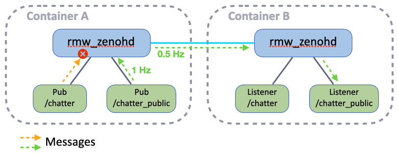

# Exercise 7 - Downsampling

By configuration the Zenoh router can perform downsampling (i.e. reducing the frequency of messages) for some topics published via a specified interface.

## Configuration

<p align="center"></p>

Follow up with the same partner than the previous exercise.

In container A add this `downsampling` configuration at the end of your `zenoh_confs/ROUTER_CONFIG.json5` file (just before the last `}`):

```json5
downsampling: [
  {
    // Downsampling publications ("push" messages, and "reply" in case of TRANSIENT_LOCAL publisher)
    // in egress direction on WiFi interface
    messages: ["push", "reply"],
    flows: ["egress"],
    interfaces: ["<YOUR_WIFI_INTERFACE>"],
    rules: [
      // 0.6Hz for the Zenoh key expression used for the "/chatter_public" topic
      {
        key_expr: "*/chatter_public/**",
        freq: 0.6
      },
    ],
  },
],
```

## Running the Test

Run the same commands than for previous exercise:

* In container A:
  * Start the router (with the custom configuration): `ZENOH_ROUTER_CONFIG_URI=/ros_ws/zenoh_confs/ROUTER_CONFIG.json5 ros2 run rmw_zenoh_cpp rmw_zenohd`
    You can also add this environment variable to see the router applying the access control:
    `RUST_LOG=info,zenoh::net::routing::interceptor=trace`
  * Start the publisher on the denied topic:
    `ros2 topic pub /chatter std_msgs/msg/String "data: Hello just me!"`
  * Start another publisher on an allowed topic:
    `ros2 topic pub /chatter_public std_msgs/msg/String "data: Hello World!"`
* In container B:
  * Start the router (with the default configuration): `ros2 run rmw_zenoh_cpp rmw_zenohd`
  * Start the listener on the denied topic:
    `ros2 topic echo /chatter`
  * Start the listener on an allowed topic:
    `ros2 topic echo /chatter_public`

And see the result in the listener on `/chatter_public`.
